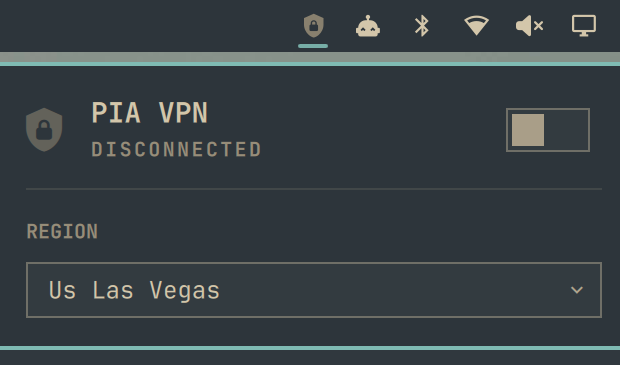

# NordVPN — Omarchy bar widget

A widget for [Omarchy](https://omarchy.org/) that controls the official
NordVPN Linux client from the top bar, with quick connect, disconnect, and a
searchable country selector.



## Requirements

- Omarchy with the Quickshell-based plugin system.
- The official NordVPN Linux client installed, with `nordvpn` available on
  `PATH`.
- The client authenticated and its daemon running. Test it with:

  ```bash
  nordvpn status
  ```

The plugin only runs `nordvpn status`, `nordvpn countries`, `nordvpn connect`,
and `nordvpn disconnect`. It does not access NordVPN credentials or modify
NordVPN configuration files.

## Installation

```bash
omarchy plugin add https://github.com/guiestrela/omarchy-nordvpn-plugin.git --enable
```

To install manually:

```bash
git clone https://github.com/guiestrela/omarchy-nordvpn-plugin.git \
  ~/.config/omarchy/plugins/io.github.guiestrela.nordvpn
omarchy plugin validate ~/.config/omarchy/plugins/io.github.guiestrela.nordvpn
omarchy plugin enable io.github.guiestrela.nordvpn --section right
```

## Usage

- Left-click: open or close the popup.
- Right-click: refresh the connection status.
- Middle-click: connect or disconnect.
- In the popup, the switch performs a quick connect or disconnect.
- The country selector searches countries and runs `nordvpn connect <country>`.

The icon is bright when connected, dimmed when disconnected, and shown in the
alert color when the NordVPN daemon is unavailable.

## Settings

- `refreshIntervalSec` (2–60, default 5): connection status refresh interval.

## Uninstall

```bash
omarchy plugin disable io.github.guiestrela.nordvpn
rm -rf ~/.config/omarchy/plugins/io.github.guiestrela.nordvpn
omarchy-shell shell rescanPlugins
```

## License

MIT — see [LICENSE](LICENSE).
